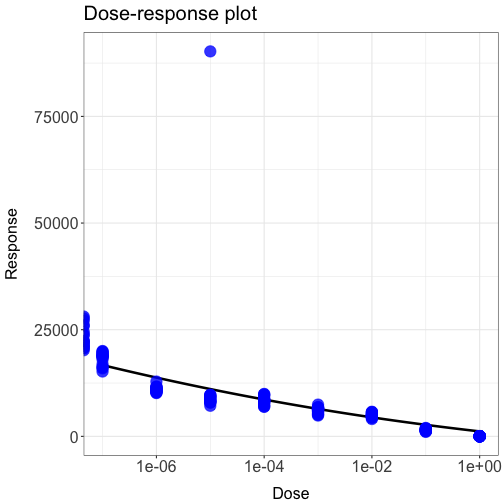

---
output:
  md_document:
    variant: markdown_github
---


#build status:

[](https://travis-ci.org/aubreybailey/dr4pl)

#license:

[](https://www.gnu.org/licenses/gpl-3.0.en.html)

#cran status:

[](https://cran.r-project.org/package=dr4pl)

#release version:

[](commits/master)


##dr4pl

The package dr4pl (Dose Response 4 Parameter Logisitic model) specializes in applying the 4 Parameter Logistic (4PL) model. The 4PL model has been recognized as a major tool to analyze the relationship between a dose and a response in pharmacological experiments. The package dr4pl may be used to model increasing and decreasing curves. The goal of dr4pl is to bring a statistical method which is capable of handeling specific error cases of which other statistical packages produce errors. Examples of Dose Response datasets that will produce errors in other packages may be accessed by name once dr4pl is loaded and these data sets are under the names of drc_error_1, drc_error_2, drc_error_3, and drc_error_4. Along with these error data sets, this package also supplies 13 standard example data sets for the 4PL model under the name sample_data_1, sampel_data_2, etc. The package dr4pl also alows for the user to decide how their theta variable is approximated. The user may choose the default logistic model or use Mead's Method. Additionally, the user may decide between four loss functions to minimize: Squared, Absolute, Huber, or Tukey's biweight. Please attempt each of the loss functions and choose the best fit from plotting the dr4pl object.

## Installation

You can install dr4pl from github with:


```r
# install.packages("devtools")
devtools::install_bitbucket("dittmerlab/dr4pl")
```

## Example

This is a basic example which shows you how to solve a common problem. This example may be used with drc_error_1, drc_error_2, drc_error_3, and drc_error_4:


```r
## basic example code, datasets
## example requires the drc and dr4pl package to be loaded
library(dr4pl)
library(drc)
#> Loading required package: MASS
#> 
#> 'drc' has been loaded.
#> Please cite R and 'drc' if used for a publication,
#> for references type 'citation()' and 'citation('drc')'.
#> 
#> Attaching package: 'drc'
#> The following objects are masked from 'package:stats':
#> 
#>     gaussian, getInitial
a <- drc::drm(drc_error_1$Response~drc_error_1$Dose, fct = LL.4())
#> Error in drmOpt(opfct, opdfct1, startVecSc, optMethod, constrained, warnVal, : Convergence failed
plot(a)
#> Error in plot(a): object 'a' not found
```


```r
## basic example code
## example requires the dr4pl package to be loaded
b <- dr4pl(drc_error_1$Response~drc_error_1$Dose, method.init = "logistic", method.robust = "Tukey") 
plot(b)
#> Warning: Transformation introduced infinite values in continuous x-axis

#> Warning: Transformation introduced infinite values in continuous x-axis
```



```r
summary(b)
#> $call
#> dr4pl.formula(formula = drc_error_1$Response ~ drc_error_1$Dose, 
#>     method.init = "logistic", method.robust = "Tukey")
#> 
#> $coefficients
#>                 Estimate       StdErr       t.value p.value
#> UpperLimit  7.913355e+04 2.538637e-01  3.117166e+05       0
#> IC50        4.258701e-13 3.054816e-04  1.394094e-09       1
#> Slope      -7.370728e-02 2.481119e-06 -2.970728e+04       0
#> LowerLimit -8.393064e+03 6.511088e-01 -1.289042e+04       0
#> 
#> attr(,"class")
#> [1] "summary.dr4pl"
```
